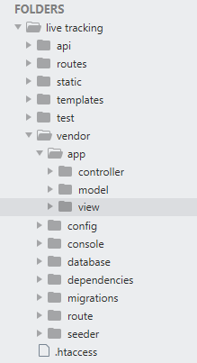

# leggo
A MVC based framework written in php

Table of content
<ul>
  <li>About Leggo</li>
  <li>Installing Leggo</li>
  <li>Architecture of leggo framework</li>
  <li>Working of leggo</li>
  <li>Directory Hierarchy of leggo</li>
  <li>Defining your web route</li>
  <li>Creating a controller for you web route</li>
  <li>Creating a view</li>
  <li>Creating a model</li>
  <li><b>Database:Migrations</b></li>
  <li>What is database migration</li>
  <li>Generating a migration </li>
  <li>Migration structur</li>
  <li>Running a migration</li>
  <li><b>Database:Seeders</b></li>
  <li>what is seeders</li>
  <li>Writing a seeder</li>
  <li>Running a seeder</li>
  <li><b>Framework dependencies</b></li>
</ul>

<h2>About Leggo</h2>
<p>
Leggo is a lite MVC based framework which is written in PHP.It is comes with a CLI client to faciliate the rapid development. It is for developers who want to customize the code without worring about what undergoing the hood. Leggo provide you a simple directory hierarchy which you can work with easily. 
Unlike another heavy weight framework like Laravel, symphony, cakePHP there are not lot of files included in a a single script. A developers can easily figure out which framework file is used by the current scipt/code.The main advantage of this is customization. Now when developers know what going in background they can easily customize the code according to them self. By default a data abstraction layer is provided to intract with database and handle all the sql transactions dynamically. If a developers want to integrate ORM they can integrate ORM of there choice. 
Leggo uses the concept of template, we can define a template for particular route in templates directory. To access the template we only have to provide a $template_name variable with the the name of template .Currently it did not uses any template engine . But in later version of leggo developers can eaisly integrate template engine of there choice. 
Leggo is a pure MVC based framework in which all the data is handle by its views . It provide the power to develop a powerfull, scalable yet secure webapp without hassling with logic part. It facilitate its user to integrate ORM(object relational mapper ) like propel , doctrine etc  and template engines of there choice. It did not force user to use any particular 

</p>
<h2>Installing Leggo</h2>
<p>You can download leggo to your machine by two ways</p>

<h3>Install from github</h3>
<p>
 To install run following command into your git bash shell<br/><br/>
  <code><b> $ > git clone https://github.com/thecodestuff/leggo.git </b></code>
</p>
<h3>Install using package manager</h3>
<p>To install using composer run following command</p>
<code><b> $ > require install/leggo </b></code>

<h2>Architecture of leggo framework</h2>
<p>artictech image here</p>
<p>Leggo uses MVC design pattern under the hood.MVC stand for model view controller. In a typical MVC framework all the logic is handle by the controller, database interaction is handled by the its respective model and all the front-end code is stored in its respective template which is fetched by its respective view.</p>

<h2>Working of leggo</h2>
<p>
  In leggo all start with defining a web route in <em>vendor/app/route/web.php</em>. our <em>.htaccess</em> is configured in a such a way that every request from the client is route to the <b>index.php</b> file in root directory. Index file call the <bweb.php</b> in which all web route are written.Framework checks weather a web route/url is valid or not. 
If request is not valid a error message is shown to the user else controller is evoked by the leggo. Once controller is evoked its view and model are also evoked. View check for the template mention in <em>$template_name variable</em> in view class in <em>leggo/template</em> directory. 
</p>

<h2>Directory Hierarchy of leggo</h2>


<h2>Defining your web route </h2>
<p> 
 A web is a URL which evokes a particuallar controller .
  To define a web route navigate to <em><b> /vendor/route/web.php </b></em> file
  <br/>
  
  ```php
  Route::get('helloworld/' , 'HelloWorldController@index') ;
```
Route::get function accept to parameter .First parameter is the name of your route and the second parameter is the name of controller and the name of function.
</p>

<h2>Creating a controller for you web route</h2>
<p>
Leggo comes with its CLI tool, using this you can create controller file for your  route. 
To create a controller file use below command. 

```php
$ > php console make::controller HelloWorldController
```
navigate to your <em>/vendor/app/controllers</em> directory you will find that your controller created with some code already added for you to get start with .

Your typicall controller file looks like this 

```php
<?php 
class HelloWorldController extends controller{
	public $view  ;
	/**
	 * evoke repective view for this controller and uri
	 */
	public function index(){
		# initilizing view to work with view class
		$this->view = new HelloWorldView ;
		$this->view->output() ;

	}
}
?>
```
Here HelloWorldController class extends to base controller class. Base controller hava a function name view() which evokes the view of particullar route 
A typicall controller.php file look like this 

```php
<?php 
# This is a base controller 
# Its functionality can be accessed by other controllers 

class controller{
	public static function view($viewName ){
		require $_SERVER['DOCUMENT_ROOT'].'/live tracking/vendor/app/view/'.$viewName.'.php' ;
		
	}

}

?>
```
Now you have created a controller for your web route , its time to create a view for your controller 
</p>

<h2>Creating a view</h2>
<p>
  A view contain a logic which enable user to transport the data fetch by the model from the database to the template. It work in hand with templates which are nothing more than HTML file. 
To create a view using CLI tool , hit below command in  your console.

```php
$ > php console make:view HelloWorldView
```
A view class template looks like this.

```php
<?php 
/**
 * Class : HelloWorldView
 * render data with template and output html content
 */

class HelloWorldView extends View{

 	public $template_name = 'helloWorld.blade' ;
 	public $data ;

 	public function __construct(){
 		// intilizing HelloWorldModel 
 		$this->model = new HelloWorldModel ; 		
 	}

 	public function output(){
 		$this->data = $this->model->get_test_data() ;
 		$this->render($this->template_name , $this->data) ;
 	}

}

?>
```
In <em><b>$template_name</b></em> we can mention the template which we want to use for the particular view class. You have to create a template name <em><b>helloWorld.blade.html</b></em> in a <em>/templates</em> directory in your root folder . 

<h2>Creating a model</h2>
<p>
A model is script which contains the logic to interact with the database table. A single model is associate with a single table in a database.Model uses the data abstraction layer to interact with the database.
To create a model in leggo using as CLI tool, you just need to hit below command.
  
 ```php
 $ > php console make:model HelloWorldModel  -t helloWorldTable
 ```
 A typical  a model look like this 
 
 ```php
 <?php 
/**
 * Class : HelloWorldModel 
 * This class fetch data from the HelloWorldTable from database
 */

class HelloWorldModel extends Model{
	private $table_name ='HelloWorldTable' ;

	public function get_test_data(){
		// intilizing model instance 
		parent::__construct() ;
    
		$sql = 'SELECT * FROM '.$this->table_name ;
    
		$this->db->query($sql) ;
		$row = $this->db->resultset() ;
    
		return $row ;
	}
}

?>
 ```
A HelloWorldModel inhert functionalities from the base model model.php . Here <b>model.php</b> look like :

```php
<?php 
/**
 * Class :Model 
 * 
 * Create a new instance of the Database class.
 * 
 * The Model class is an abstract class that creates
 * a new instance of the Database class, allowing us
 * to interact with the database without having to create
 * a new instance in each class.
 */
require $_SERVER['DOCUMENT_ROOT'].'/live tracking/vendor/database/Database.php'  ;

use database\Database as Database ;

abstract class Model{

	public $db ;

	public function __construct(){
		/**
		 * It creat a database handler oject using it child models can interact with database layer and db
		 */
		$this->db = new Database() ;
		
	}
}

?>
```


</p>
</p>

<h1>[2] Database:Migrations</h1>
<h2>2.1 What is Migrations ?</h2>
<p>
Migrations are like version control for your database, allowing your team to easily modify and share the application's database schema. Migrations are typically paired with leggo’s schema builder to easily build your application's database schema. If you have ever had to tell a teammate to manually add a column to their local database schema, you've faced the problem that database migrations solve.
</p>

<h2>2.2 Generating a migration</h2>
<p>
To create a migration, use the make:migration
	
```php
$ > php console make:migration createTagTable
```

the new migration will be placed in your <em><b>vendor/migrations</b></em> directory. Each migration file name contains a timestamp which allows leggo to determine the order of the migrations.
The <em><b>--table</b></em>  options may also be used to indicate the name of the table and whether the migration will be creating a new table. These options pre-fill the generated migration stub file with the specified table.
</p>

<h2>2.3 Migration Structure</h2>
<p>
A migration class contains two methods: up and down. The up method is used to add new tables, columns, or indexes to your database, while the down method should reverse the operations performed by the up method.
Within both of these methods you may use the leggo schema builder to expressively create and modify tables. To learn about all of the methods available on the <em>Schema</em> builder.

For example this migration creates a tag table .<br/>
<em><b>creatTagTable.php</b></em>
```php
<?php 
$vendorDir = dirname(dirname(__FILE__));
$baseDir = dirname($vendorDir);

$path = str_replace("\\", "/" , $baseDir) ;
$path .='/vendor/database/Migration.php' ;

require $path ;

use database\migration\Migration as Migration ;

//migation template
class CreateTagTable extends Migration{
	public $table_name = 'tagsTest' ;

	public function up(){
		#code goes here...
		$this->create($this->table_name , '[
			{
				"columnName":"id" ,
				"attributes":["INT(6)" ,"NOT NULL" ,"AUTO_INCREMENT" , "PRIMARY KEY"] 
			} ,

			{
				"columnName":"tagName" , 
				"attributes" :["VARCHAR(20)" ,"NOT NULL"]
			} ,
			{
				"columnName":"testField" ,
				"attributes":["VARCHAR(50)" ,"NOT NULL" ]
			}
		]');
	}

	public function down(){
		#code goes here...
	}
}

?>
```
In up() function we defined the structure of table in JSON format . When you run this migration you will find that a table name 'tagTest' create by leggo in our database . 

Each child migration inherit its properties and functionalites from its base migration class . you can fin base migration file migration.php in <em><b>/vendor/database/ directory</b></em> . 
Its look like this .<br/> <b>migration.php</b>

```php
<?php 
namespace database\migration;
/**
 * Class : Migration
 * This class provide the functionailty to create tables
 */

# Including database drivers 
#$path = __DIR__.'\Database.php' ;
#require $path ;

#use database\Database as DB;

class Migration{

	/**
	 * This function lets you create table 
	 */
	protected function create($tableName , $params){
		
		#DB::test() ;
		#var_dump( json_decode($params) );
		$feed = json_decode($params) ;
		$sql = 'CREATE TABLE '.$tableName.'(' ;

		# parsing json feed 
		foreach($feed as $obj=>$k){
			$attr = implode(' ', $k->attributes ) ;
			$sql .= ' '.$k->columnName.' '.$attr.',' ;

		}
		$sql = substr($sql , 0, -1) ;
		$sql .=')' ;

		#connecting to database 
		$conn = new \mysqli("localhost", "root", "" ,"jaipur_transit");

		if ($conn->connect_error) {
    		die("Connection failed: " . $conn->connect_error);
		} 
		
		if ($conn->query($sql) === TRUE) {
    		echo "Table $tableName created successfully";
		} else {
    		throw new \Exception("oops something happened check your schema again...") ;
		}

		$conn->close();

	}

	/**
	 * This function build the sql query 
	 */
	public function schema(){
	}

	
}
?>
```
</p>
<h2>2.4 Running a migration </h2>
<p>
To run all of your outstanding migrations, execute the migrate php console  command.

```php
$ > php console migrate createTagTable
```
</p>

<h1>[3] Datbase:Seeders</h1>
<h2>3.1 What is Seeders ?</h2>
<p>
Leggo includes a simple method of seeding your database with test data using seed classes. All seed classes are stored in the Vendor/seeder directory. Seed classes may have any name you wish, but probably should follow some sensible convention, such as UsersTableSeeder, etc. By default, a DatabaseSeeder class is defined for you. From this class, you may use the call method to run other seed classes, allowing you to control the seeding order.
Seeder class extends Database class .It also uses a third party plugin named faker to generate fake data and insert automatically into the database without need to expilicitly inset the rows of data. 

</p>

<h2>3.2 Writing a seeder</h2>
<p>
To generate a seeder, execute the <b>make:seeder</b> php console command. All seeders generated by the framework will be placed in the <em><b>vendor/seeder directory</b></em>

```php
$ > php console make:seeder userTableSeeder
```

Leggo seeders uses a package called faker to insert a fake data . Instering a fake data automatically will comes handy while developing and testing a application .It eliminates the need to manually insert rows of data into database .

We can define a fake data in a seed file like this.

```php
<?php 

/**
 * including Seeder.php
 */
$vendorDir = dirname(dirname(__FILE__));

$path = str_replace("\\", "/" , $vendorDir) ;
echo 'path='.$path ;

if(file_exists( $path.'/database/Seeder.php' )){
	echo 'file included successfully...' ;

	require $path.'/database/Seeder.php' ;
}else{
	echo 'file not exits...' ;
}

use database\seeder\Seeder as Seeder ;

class UserSeeder extends Seeder{

	public function factory(){
		
		/**
		 * Define your faker data structure 
		 * column name followed by the type of data you want in it 
		 */
		$this->define('test99' , '2' , function(){
			$faker = $this->faker ;
			return [
				'name' =>$faker->name ,
				'email'=>$faker->email 
				
				] ;
		}) ;
	}

	public function test1(){
		echo 'hello test test' ;
	}
}

$obj = new UserSeeder ;
$obj->factory() ;
?>
```
</p>

<h1>[4] Framework Dependencies</h1>
<p>
Dependencies : 
Dependencies are the third party packages or code that is integrated with the framework to extent either the functionality of a framework or to support the inner functionality. 
Here is the dependencies for the leggo framework are listed : 
<ul>
	<li><b>	Fznaninotto/Faker</b>: php liberary to generate fake data </li>
	<li><b>	Symphony console component</b>: working with CLI console.</li>
	<li><b>	Pusher </b>: push notification liberary.</li>
	<li><b>	Data abtractionlayer</b>:  A wrapper for interacting with database.</li>
</ul>
</p>
